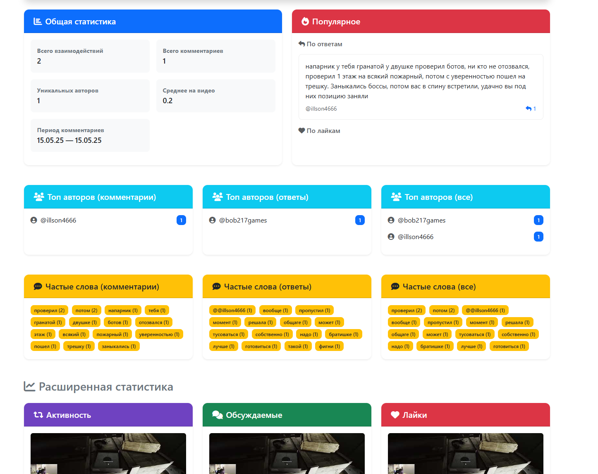
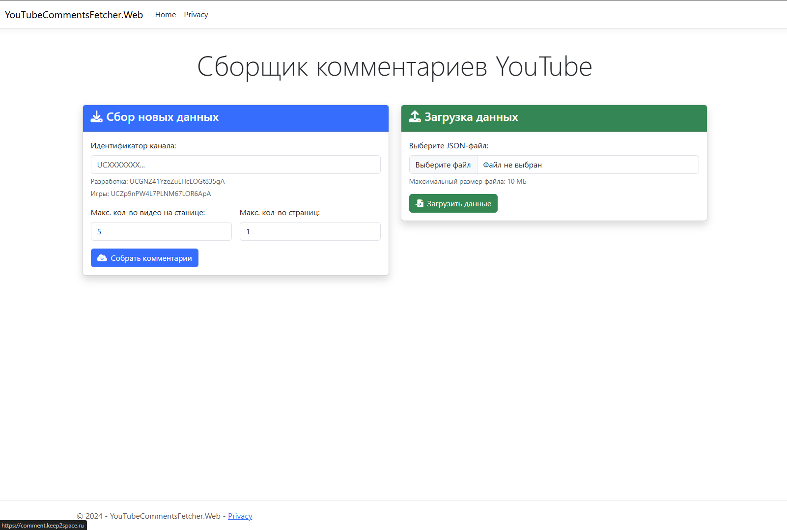
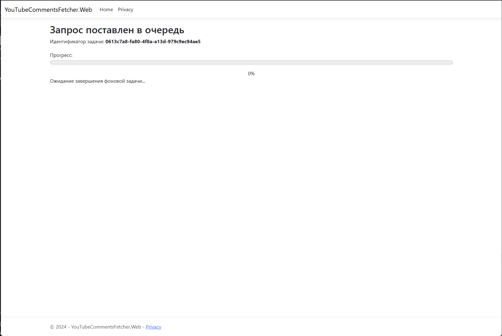
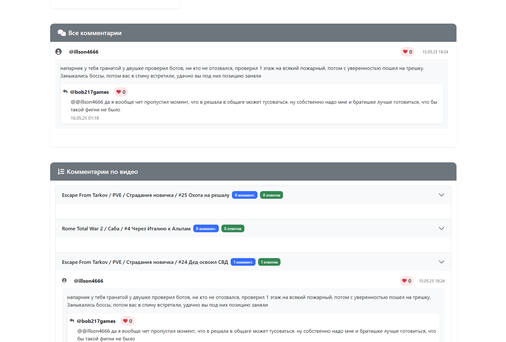

# YouTube Comments Fetcher

[](https://hub.docker.com/r/thevsakeeper/youtubecommentsfetcherweb)
[](https://github.com/TheVSAKeeper/YouTubeCommentsFetcher/actions/workflows/docker-image.yml )

YouTube Comments Fetcher — это веб-приложение, разработанное на ASP.NET Core, которое позволяет извлекать, анализировать
и отображать комментарии с YouTube каналов. Приложение поддерживает фоновую обработку данных, сохранение результатов в
JSON-файлы и предоставляет удобный интерфейс для просмотра аналитики.

---

## 📌 Основные возможности

- **Извлечение комментариев** по ID канала YouTube
- **Фоновая обработка** с использованием Quartz.NET для долгих задач
- **Аналитика комментариев**: статистика, топ авторов, популярные видео, частые слова
- **Сохранение/загрузка** данных в формате JSON
- **Веб-интерфейс** для управления и просмотра результатов

---

## 🛠 Технологии

Проект использует современный стек технологий:

| Компонент       | Технология                                                            |
|-----------------|-----------------------------------------------------------------------|
| Веб-фреймворк   | [ASP.NET Core 9.0](https://dotnet.microsoft.com/platform/aspnet-core) |
| API YouTube     | [Google.Apis.YouTube.v3](https://developers.google.com/youtube/v3)    |
| Фоновые задачи  | [Quartz.NET](https://www.quartz-scheduler.net/)                       |
| Логирование     | [Serilog](https://serilog.net/)                                       |
| Контейнеризация | [Docker](https://www.docker.com/)                                     |
| CI/CD           | [GitHub Actions](https://github.com/features/actions)                 |

---

## 🚀 Установка и запуск

### 🔹 Через Docker (рекомендуется)

```bash
docker pull thevsakeeper/youtubecommentsfetcherweb:latest
docker run -p 8080:8080 -e YouTubeApiKey=ваш_ключ_API thevsakeeper/youtubecommentsfetcherweb:latest
```

После запуска откройте браузер и перейдите по адресу: [http://localhost:8080](http://localhost:8080)

> Получить ключ API можно в [Google Cloud Console](https://console.cloud.google.com/apis/credentials).

---

### 🔹 Локальная сборка

1. Клонируйте репозиторий:
   ```bash
   git clone https://github.com/TheVSAKeeper/YouTubeCommentsFetcher.git
   cd YouTubeCommentsFetcher
   ```

2. Восстановите зависимости:
   ```bash
   dotnet restore --locked-mode
   ```

3. Запустите приложение:
   ```bash
   dotnet run --project YouTubeCommentsFetcher.Web
   ```

4. Перейдите по ссылке: [http://localhost:8080](http://localhost:8080)

---

## 📁 Сохранение и загрузка данных

Приложение позволяет:

- **Сохранять** комментарии в JSON-файл для последующего использования.
- **Загружать** ранее сохраненные данные через интерфейс.

---

## ⚙️ Настройка

Для конфигурации API-ключа YouTube:

### Разработка

```bash
dotnet user-secrets set "YouTubeApiKey" "ваш_ключ_API" --project YouTubeCommentsFetcher.Web
```

### Production (через Docker)

```bash
docker run -p 8080:8080 -e YouTubeApiKey=ваш_ключ_API thevsakeeper/youtubecommentsfetcherweb:latest
```

---

## 📈 Пример аналитики

После извлечения комментариев вы увидите:

- Общая статистика: количество комментариев, уникальных авторов, среднее на видео
- Топ авторов по активности
- Популярные комментарии (по лайкам и ответам)
- Часто используемые слова
- Самые комментируемые видео



---

## 🧭 Руководство пользователя

Ниже приведено пошаговое руководство по использованию приложения.

---

### Шаг 1: Открытие главной страницы

Откройте браузер и перейдите по адресу [http://localhost:8080](http://localhost:8080). Вы увидите главную страницу
приложения.



---

### Шаг 2: Ввод ID канала

1. Найдите YouTube-канал, чьи комментарии вы хотите проанализировать.
2. Скопируйте ID канала из URL-адреса. Например, если URL `https://www.youtube.com/channel/UCXXXXXXXXXXXX`, то ID —
   `UCXXXXXXXXXXXX`.
3. Вставьте ID в поле **Идентификатор канала:** на главной странице.
4. Выберите параметры **Макс. кол-во видео на станице** и **Макс. кол-во страниц**, если нужно изменить значения по
   умолчанию (5 и 1 соответственно).
5. Нажмите кнопку **Собрать комментарии**.

---

### Шаг 3: Ожидание завершения фоновой задачи

После отправки запроса система начнет извлекать комментарии в фоновом режиме. Вы будете перенаправлены на страницу
отслеживания прогресса.



На этой странице отображается индикатор прогресса и текущий статус задачи. Процесс может занять некоторое время в
зависимости от количества комментариев.

---

### Шаг 4: Просмотр результатов

Когда задача завершится, вы автоматически перейдете на страницу результатов. Здесь будут отображены:

- **Общая статистика**
- **Топ авторов**
- **Популярные комментарии**
- **Частые слова**
- **Видео с наибольшим количеством комментариев**



Вы можете просмотреть все комментарии как в общем списке, так и группированными по видео.

---

### Опционально: Сохранение результатов

Если вы хотите сохранить результаты для дальнейшего использования:

1. Нажмите кнопку **Сохранить как JSON**.
2. Браузер предложит скачать файл с данными.
3. Сохраните его на свой компьютер.

---

### Опционально: Загрузка ранее сохраненных данных

Если вы хотите снова посмотреть уже сохраненные комментарии:

1. Вернитесь на главную страницу.
2. Используйте форму **Загрузка данных**.
3. Нажмите **Выберите файл** и выберите JSON-файл с вашими данными.
4. Нажмите **Загрузить данные**.

После загрузки вы попадете на страницу результатов с этими данными.

---

## 🐳 Docker

Проект поддерживает контейнеризацию:

```bash
docker build -t youtubecommentsfetcher -f YouTubeCommentsFetcher.Web/Dockerfile .
docker run -p 8080:8080 -e YouTubeApiKey=ваш_ключ_API youtubecommentsfetcher
```

---

## 🔄 CI/CD

Автоматическая сборка и публикация образа осуществляются через GitHub Actions:

- [Workflow Docker Image](.github/workflows/docker-image.yml)

Образ доступен на Docker Hub:  
[thevsakeeper/youtubecommentsfetcherweb](https://hub.docker.com/r/thevsakeeper/youtubecommentsfetcherweb)
